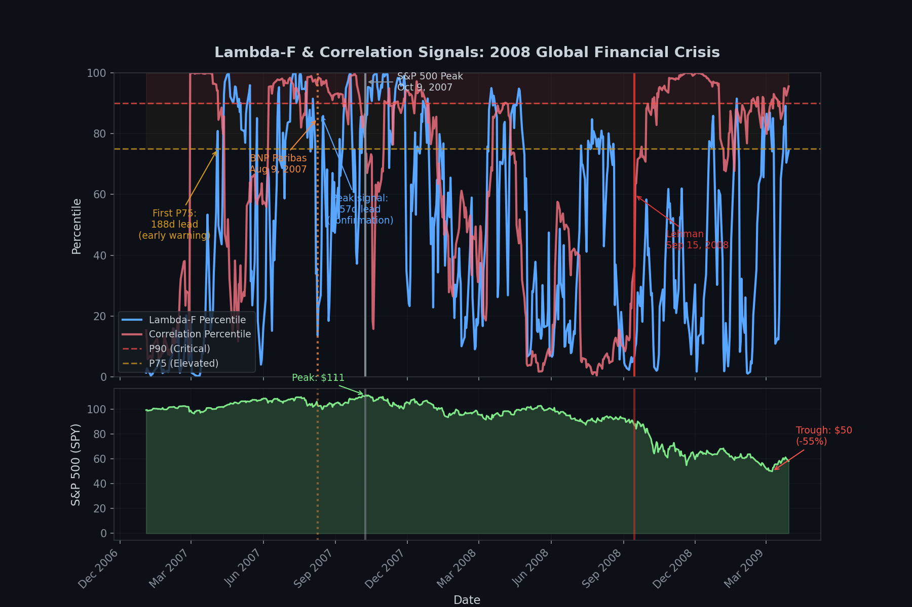

# Lambda-F: Market Regime Detection

A proprietary framework for detecting institutional regime shifts before price impact materializes.

## Live Signal (Updated Daily)

<!-- LAMBDA_START -->
| Market | Lambda-F | L Pctl | Elev | Correlation | C Pctl | Regime | Since | Updated |
|--------|----------|--------|------|-------------|--------|--------|-------|---------|
| Commodities | 3.57 | 94% | 14d* | 0.26 | 78% | **CRITICAL** (L) | 2026-01-04 | 2026-01-06 |
| Gold | 3.54 | 78% | 6d* | 0.23 | 58% | **CRITICAL** (L) | 2026-01-04 | 2026-01-06 |
| Crypto (BTC) | 3.39 | 76% | 2d | 0.81 | 61% | Normal | 2026-01-02 | 2026-01-06 |
| US Equity (SPY) | 3.52 | 68% | -- | 0.33 | 24% | Normal | 2025-11-15 | 2026-01-06 |
| UK Equity (EWU) | 3.34 | 53% | -- | 0.49 | 8% | Normal | 2025-12-01 | 2026-01-06 |
| Germany (EWG) | 3.15 | 25% | 6d | 0.37 | 11% | ELEVATED (L) | 2026-01-04 | 2026-01-06 |
| Bonds | 3.26 | 34% | 8d | 0.76 | 63% | ELEVATED (L) | 2026-01-06 | 2026-01-06 |
| Emerging Markets | 2.84 | 4% | -- | 0.31 | 16% | Normal | 2026-01-05 | 2026-01-06 |
<!-- LAMBDA_END -->

### Regime Classification

| Regime | Interpretation |
|--------|----------------|
| **CRITICAL** | Major regime shift in progress |
| **ELEVATED** | Above-normal institutional activity |
| Normal | Baseline conditions |

### Signal Attribution

| Code | Meaning |
|------|---------|
| L | Lambda-F triggered (factor rotation) |
| C | Correlation triggered (synchronized move) |
| LC | Both signals (maximum stress) |

---

## What Is This?

Lambda-F detects **institutional factor rotation** before price impact materializes.

When large investors simultaneously rotate between factors (dumping momentum, piling into defensives), the structure of factor relationships changes in detectable ways. Combined with a correlation signal for synchronized panic events, this achieves 100% detection on institutional regime shifts while correctly excluding exogenous shocks.

**Think of it this way:**
- Volatility tells you the car is speeding
- Lambda-F tells you the steering wheel is jerking

---

## Validation Summary

### Detection Rate: 33/33 Events (100%)

| Market | Events | Detection Rate |
|--------|--------|----------------|
| Commodities | 4 | **100%** |
| Gold | 2 | **100%** |
| Crypto | 3 | **100%** |
| US Equity | 4 | **100%** |
| UK Equity | 3 | **100%** |
| Germany | 3 | **100%** |
| Bonds | 6 | **100%** |
| Emerging Markets | 8 | **100%** |

### Key Detections

| Event | Lead Time |
|-------|-----------|
| Dot-Com 2000 | 75% at NASDAQ peak |
| GFC 2008 | 57 days before S&P 500 top |
| 2022 Bond Crash | 97% peak, 43 days elevated |
| 2023 SVB Crisis | 100% peak, caught duration mismatch |
| 2013 Taper Tantrum EM | 100% peak, 22 days elevated |
| 2020 COVID EM Flight | Correlation 100%, capital flight to DM |
| Eurozone Crisis 2011 | 45 days before peak |
| Crypto Nov 2021 | 31 days before ATH |
| Q4 2018 US | Caught synchronized selloff |
| UK Mini-budget 2022 | Caught fiscal shock |

### Black Swan Exclusions (4/4 Correct)

COVID-19, Terra/Luna, 3AC, FTX -- all correctly showed **LOW** signals.

These were exogenous shocks with no institutional precursor. The framework detects institutional behavior, not external events. This is by design.

---

## Signal Visualization

**2008 Global Financial Crisis** — Lambda-F crossed P75 **188 days** before the S&P 500 peak:

*Lambda-F first crossed ELEVATED in April 2007 (188-day early warning). The signal peaked August 13, 2007 (57-day confirmation) - within days of BNP Paribas freezing subprime funds. Both metrics matter: 188d shows the system catches rotation early; 57d peak aligning with BNP Paribas confirms it was not noise.*

---
## Methodology

**Patent Pending** -- US Provisional Application filed.

Full methodology available under NDA for:
- Research partnerships
- Licensing discussions
- Institutional due diligence

---

## Real-Time Feed (Beta)

Building a real-time API with alerts. Interested in early access?

**[Join the Beta Waitlist](https://docs.google.com/forms/d/e/1FAIpQLSdo9MykqIj8n3_mJj54OzZNZ4P45Dg7GVBt0i4BqSHE1daSPQ/viewform)**

---

## Contact

R.J. Mathews | [mail.rjmathews@gmail.com](mailto:mail.rjmathews@gmail.com)

(c) 2026 -- All rights reserved. Patent pending.
