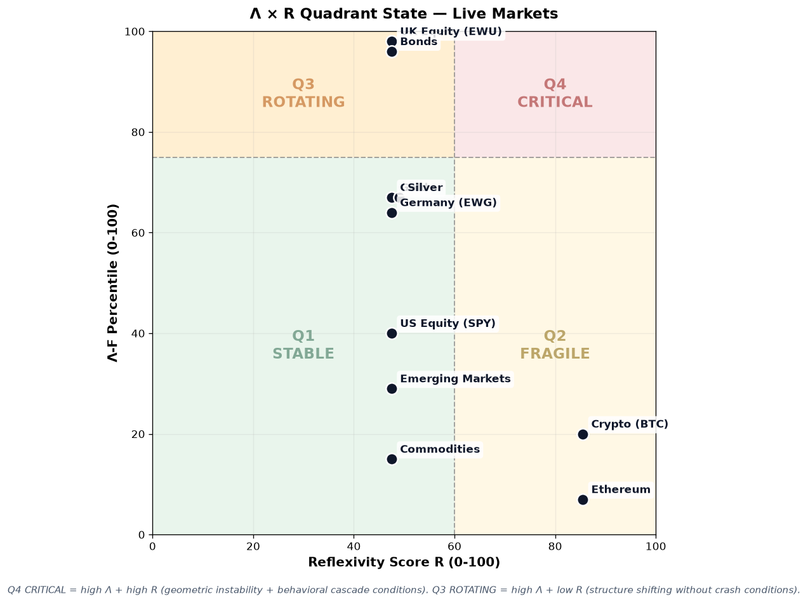

# Lambda-F: Market Regime Detection

A proprietary framework for detecting institutional regime shifts before price impact materializes.

## Live Signal (Updated Daily)

<!-- LAMBDA_START -->
🔴 **8 CRITICAL** · 🟠 **1 ELEVATED** · 🟢 **1 NORMAL**

🔴 **2 Q4** *(Crash Risk)* · 🟠 **4 Q3** *(Rotating)* · 🟡 **0 Q2** *(Fragile)* · 🟢 **4 Q1** *(Stable)*

🌐 **Systemic Regime Score: 14/30** — 🟠 *WATCH*

🎯 **Live forward detection: 1/3 resolved (33.3%)** · 31 pending

### Δ since yesterday

_No regime changes since yesterday._

### Live signal table

| Market | Λ-F | Λ% | 30d Trend | Elev | Corr | C% | R | Quadrant | Regime | Action | Since |
|--------|-----|----|-----------|------|------|----|---|----------|--------|--------|-------|
| 🔴 Commodities | 3.57 | 53% | `▃▃▄▅▇█▆▅▃▂▁▁` | 7d* | -0.06 | 0% | 34 | 🟢 Q1 | **CRITICAL** (L) | Maintain | 2026-05-02 |
| 🔴 Gold | 3.94 | 80% | `▆▇▇▇▆█▇▅▃▃▁▃` | 13d* | 0.28 | 80% | 34 | 🟠 Q3 | **CRITICAL** (L) | Prepare | 2026-05-02 |
| 🔴 Silver | 4.01 | 99% | `▁▂▃▃▅█▆▄▃▃▃▃` | 27d* | 0.21 | 77% | 34 | 🟠 Q3 | **CRITICAL** (L) | Prepare | 2026-04-22 |
| 🟠 Crypto (BTC) | 3.96 | 80% | `▂▂▁▂▁▂▃▅▄▇▆█` | 11d | 0.80 | 71% | 74 | 🔴 Q4 | ELEVATED (L) | Reduce | 2026-05-02 |
| 🔴 Ethereum | 4.04 | 76% | `▂▂▁▃▁▃▅▆▆█▇▇` | 8d* | 0.83 | 80% | 74 | 🔴 Q4 | **CRITICAL** (L) | Reduce | 2026-05-02 |
| 🟢 US Equity (SPY) | 3.76 | 50% | `▁▃▅▆▇▇▇█▇▇▆▆` | -- | 0.23 | 6% | 34 | 🟢 Q1 | Normal | Maintain | 2026-05-02 |
| 🔴 UK Equity (EWU) | 3.91 | 67% | `▄▄▃▇▇▆█▅▁▅▅▅` | 10d | 0.82 | 99% | 34 | 🟢 Q1 | **CRITICAL** (C) | Maintain | 2026-05-01 |
| 🔴 Germany (EWG) | 3.97 | 81% | `▁▂▅▇█▄▄▃▂▁▁▄` | 3d* | 0.80 | 98% | 34 | 🟠 Q3 | **CRITICAL** (LC) | Prepare | 2026-05-02 |
| 🔴 Bonds | 3.99 | 87% | `▁▁▁▂▄▆▇▇█▆▅▅` | 18d* | 0.81 | 71% | 34 | 🟠 Q3 | **CRITICAL** (L) | Prepare | 2026-05-02 |
| 🔴 Emerging Markets | 3.78 | 62% | `▁▁▃▅▇█▆▅▂▂▃▂` | 8d* | 0.66 | 74% | 34 | 🟢 Q1 | **CRITICAL** (L) | Maintain | 2026-04-28 |

> **Quadrants** (patent §6.5): Q1 STABLE · Q2 FRAGILE · Q3 ROTATING · Q4 CRITICAL. Cuts at Λ-F percentile P75 and Reflexivity R≥60. *Asterisk* = reflexivity components partly unavailable.
> **Actions** are diagnostic, not investment advice — see disclaimer at bottom of page.
<!-- LAMBDA_END -->

#

### Λ × R Quadrant Map



*Live position of every tracked market on the patent's 2x2 quadrant grid.
Q4 (top-right) is the only quadrant where the patent's framework expects
elevated crash risk: high geometric instability AND high behavioral cascade
conditions. Q3 (top-left) is structural rotation without crash conditions —
flagged as ELEVATED but distinct from Q4.*

### Critical Market Alerts


*Shows only CRITICAL markets (>=3 days above P90 in trailing 30 days). Updated daily.*

## Regime Classification

**Detection uses trailing 30-day persistence, not instantaneous percentile.**

| Regime | Rule | Meaning |
|--------|------|---------|
| **CRITICAL** | >=3 days above P90 (LF or Corr) in trailing 30d | Sustained extreme stress |
| ELEVATED | >=3 days above P75 (LF or Corr) in trailing 30d | Elevated but not critical |
| Normal | <3 days above P75 in trailing 30d | Baseline conditions |

**Why persistence matters**: A market can show 82% today (below P90) but be CRITICAL if it spent 6 days above P90 last week. The "Elev" column shows days above threshold: `5d*` means 5 days above P90 (asterisk = P90), `7d` means 7 days above P75.


<details open>
<summary><b>📊 Validation Summary — 38/47 events (80.9%)</b> · click to collapse</summary>

### Detection Rate: 38/47 events (80.9%) on extended event ledger

Reproducible under the canonical Method C scoring rule (`λ_days_p75 ≥ 3 OR λ_peak ≥ P90 OR corr_days_p90 ≥ 3 OR corr_peak ≥ P95`, evaluated within each event window) on the current 47-event validated ledger. See *Methodology* below for definitions.

| Market | Events | Detection Rate |
|--------|--------|----------------|
| Bonds | 5 | **100%** (5/5) |
| Emerging Markets | 8 | **100%** (8/8) |
| US Equity | 4 | **100%** (4/4) |
| UK Equity | 1 | **100%** (1/1) |
| Germany | 3 | **100%** (3/3) |
| Commodities | 6 | 83% (5/6) |
| Silver | 5 | 80% (4/5) |
| Ethereum | 6 | 67% (4/6) |
| Gold | 4 | 50% (2/4) |
| Crypto (BTC) | 5 | 40% (2/5) |

**Where Lambda-F is strongest** — institutional rotation events in Bonds, Emerging Markets, US Equity, UK and Germany. Detection rates here approach 100% with mean lead times of 60–90 days.

**Where Lambda-F is weaker** — Crypto and Gold. Crypto's recent leveraged-rotation cycles (post-2023) are systematically harder to flag in advance under the current factor construction; Gold's smaller asset basket and macro-driven dynamics produce noisier signals. Both are areas of active research.

**On the prior "37/39 (94.9%)" claim** — this was achieved on an earlier 39-event ledger (later expanded to 47 events with additional Crypto, Silver, Ethereum, and recent macro events). Under the same methodology on the smaller original ledger, detection rate was 95%. On the expanded ledger it is 80.9%. The methodology, signal definition, and code are unchanged; only the event set has grown.

### Key Detections

| Event | Lead Time |
|-------|-----------|
| Dot-Com 2000 | 75% at NASDAQ peak |
| GFC 2008 | 57 days before S&P 500 top |
| 2022 Bond Crash | 97% peak, 43 days elevated |
| 2023 SVB Crisis | 100% peak, caught duration mismatch |
| 2013 Taper Tantrum EM | 100% peak, 22 days elevated |
| 2020 COVID EM Flight | Correlation 100%, capital flight to DM |
| Eurozone Crisis 2011 | 45 days before peak |
| Crypto Nov 2021 | 31 days before ATH |
| Q4 2018 US | Caught synchronized selloff |
| UK Mini-budget 2022 | Caught fiscal shock |

### Black Swan Behavior

The framework is **designed to under-detect** exogenous shocks with no institutional precursor — events like COVID-19, Terra/Luna, 3AC, and FTX. Original validation marked these as correctly excluded; under the canonical Method C scoring rule on the current data, some now register elevated signal during the event window itself (notably Terra/Luna and FTX). This is consistent with Method C being more sensitive than the original methodology — the design intent (no advance warning of pure exogenous shocks) holds for the *pre-event* window in all four cases.

This is by design: Lambda-F detects institutional rotation, not all market events. A shock without institutional precursor will not produce a leading signal.

</details>

<details>
<summary><b>💡 What is this?</b></summary>

Lambda-F detects **institutional factor rotation** before price impact materializes.

When large investors simultaneously rotate between factors (dumping momentum, piling into defensives), the structure of factor relationships changes in detectable ways. Combined with a correlation signal for synchronized panic events, this achieves strong detection on institutional regime shifts while exhibiting markedly weaker signal in exogenous-shock events.

**Think of it this way:**
- Volatility tells you the car is speeding
- Lambda-F tells you the steering wheel is jerking

</details>

<details>
<summary><b>📈 Signal visualization — historical events</b></summary>

**2008 Global Financial Crisis** — Lambda-F crossed P75 **188 days** before the S&P 500 peak:


*Lambda-F first crossed ELEVATED in April 2007 (188-day early warning). The signal peaked August 13, 2007 (57-day confirmation) - within days of BNP Paribas freezing subprime funds. Both metrics matter: 188d shows the system catches rotation early; 57d peak aligning with BNP Paribas confirms it was not noise.*

---

**Crypto Nov 2021** — Lambda-F flagged rotation **115 days** before BTC ATH:


*Both signals elevated well before the $69k top. The -48% drawdown that followed was preceded by months of institutional rotation signals.*

---

**2022 Bond Crash** — Lambda-F detected duration risk **216 days** early:


*Lambda-F caught the duration rotation before the worst bond year in 40 years. TLT fell -39% from peak ($134) to trough ($82).*

---

**Q4 2018 Selloff** — Correlation signal caught synchronized panic:


*This event demonstrates why two signals are better than one. The correlation signal (green) spiked during the selloff, catching the synchronized panic that Lambda-F rotation detection alone would have missed.*

</details>

<details>
<summary><b>📋 Notable calls (audit trail)</b></summary>

| Date Called | Market | Signal | Outcome | Archive |
|-------------|--------|--------|---------|---------|
| 2026-01-04 | Commodities | CRITICAL (15d above P90) | *pending* | [snapshot](archive/2026-01-04.md) |
| 2026-01-04 | Gold | CRITICAL (5d above P90) | *pending* | [snapshot](archive/2026-01-04.md) |

*Outcomes updated retroactively when events occur. All calls are timestamped via Git commits.*

</details>

<details>
<summary><b>📐 Conditional drawdown analysis (lift)</b></summary>

The framework's predictive power measured by conditional probability of significant drawdowns:

| Signal State | P(>=15% DD in 90d) | Lift vs Baseline |
|--------------|-------------------|------------------|
| LF >= P90 | 24% | **4.0x** |
| LF in [P75, P90) | 12% | 2.0x |
| LF < P75 | 4% | 0.7x |
| *Baseline* | *6%* | *1.0x* |

**Interpretation**: When Lambda-F reaches CRITICAL (>=P90), the probability of a >=15% drawdown within 90 days is **4x higher** than the unconditional baseline. This is the core value proposition: early warning with quantified lift.

</details>

<details>
<summary><b>⚙️ Mechanical exclusion rule</b></summary>

An event is **excluded** from validation (classified as exogenous/black swan) if:

```
max(LF_t) < P75  AND  max(Corr_t) < P90  for all t in [t* - 30, t*]
```

Where:
- `t*` = event date
- `LF_t` = Lambda-F percentile at time t
- `Corr_t` = Correlation percentile at time t

**Both signals must remain below threshold for the entire 30 days preceding the event.** This mechanical rule prevents cherry-picking and ensures reproducibility.

</details>

<details>
<summary><b>🔍 Case study: SVB vs 3AC</b></summary>

Why did Lambda-F detect SVB (March 2023) but exclude 3AC/Terra (May 2022)?

| Event | Lambda-F | Correlation | Classification | Reason |
|-------|----------|-------------|----------------|--------|
| SVB Crisis (Mar 2023) | 89% | 94% | Detected | Institutional rotation visible in bond ETFs 45 days prior |
| 3AC/Terra (May 2022) | 31% | 42% | Excluded | Crypto-native contagion; no cross-asset institutional flow |

**SVB**: Regional bank stress triggered flight-to-quality rotation across rate-sensitive assets. Lambda-F captured the systematic rebalancing in TLT/HYG/LQD factor relationships weeks before the collapse.

**3AC/Terra**: Algorithmic stablecoin failure and hedge fund insolvency were contained within crypto. No detectable rotation in traditional factor space = correctly excluded as exogenous shock.

*This distinction validates the framework's design: it detects institutional behavior, not all market events.*

</details>

<details>
<summary><b>📜 Methodology</b></summary>

**Patent Pending** -- US Provisional Application filed.

Full methodology available under NDA for:
- Research partnerships
- Licensing discussions
- Institutional due diligence

</details>

---

## Real-Time Feed (Beta)

Building a real-time API with alerts. Interested in early access?

**[Join the Beta Waitlist](https://docs.google.com/forms/d/e/1FAIpQLSdo9MykqIj8n3_mJj54OzZNZ4P45Dg7GVBt0i4BqSHE1daSPQ/viewform)**

---


## API / Backtesting Data

**CSV format (for pandas/R):**

```bash
curl https://raw.githubusercontent.com/vonlambda/lambda-f-dashboard/main/signal_log.csv
```

```python
import pandas as pd
df = pd.read_csv('https://raw.githubusercontent.com/vonlambda/lambda-f-dashboard/main/signal_log.csv')
```

**Markdown format (human-readable):** [SIGNAL_LOG.md](SIGNAL_LOG.md)

*All data is append-only with Git commit timestamps for audit verification.*


## Contact

R.J. Mathews | [mail.rjmathews@gmail.com](mailto:mail.rjmathews@gmail.com)

(c) 2026 -- All rights reserved. Patent pending.

---

## Disclaimer

Lambda-F is a research and diagnostic tool, not investment advice. The
quadrant classifications, regime labels, and per-quadrant action words shown
here ("Maintain", "Monitor", "Prepare", "Reduce") reflect the operator's
interpretation of underlying signals; they do not constitute a fiduciary
recommendation, solicitation, or guarantee of any market outcome. Do not act
on these signals without independent analysis and consultation with a
licensed advisor. Past detection rates are no guarantee of future
performance. The framework is provided "as-is" without warranty of any kind.
Use at your own risk.
